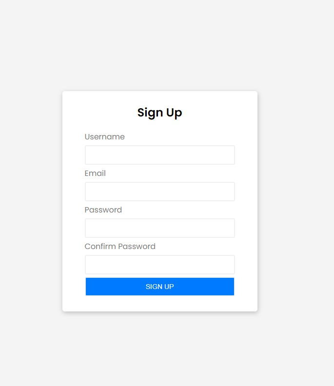
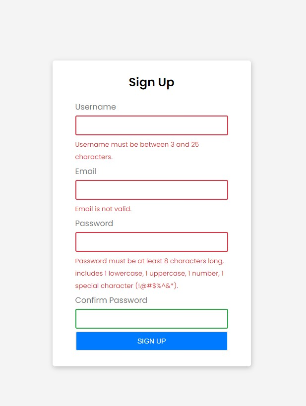

# Sign-up form Validation

### Overview

- create a simple signup form with four input field: username, email, password, and confirm-password
- when you click the signup form without filling anything the form will show error messages.

### Screenshot

- Signup form
  
- Active state
  
- Gif
  

### Built with

- Semantic HTML5
- CSS
- Flexbox
- Javascript

### Purpose

- the purpose of this application is so I can go back and study if needed

### Author

- Github - [goldreb](https://github.com/goldreb)
- Twitter - [@goldspycoder](https://twitter.com/goldspycoder)
